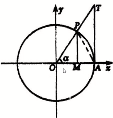
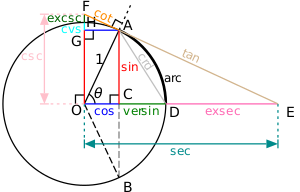
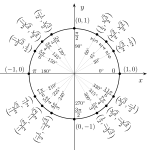

# 单位圆

$$
  \sin{a} = \frac{PM}{OP}
$$

$$
  \cos{a} = \frac{OM}{OP}
$$

$$
  PM^2 + OM^2 = OP^2
$$

$$
  \sin^2{a} + \cos^2{a} = 1
$$

$$
  \tan{a} = \frac{PM}{OM} = \frac{\sin{a}}{\cos{a}}
  = \frac{TA}{OA} = TA
$$
$$
（a \neq k \pi + \frac{\pi}{2}）
$$

# 所有三角函数在单位圆上的表现

# 正弦余弦常用转换

   |0°|30°|45°|60°|90° 
---|--|---|---|---|---
sin| 0|$\frac{1}{2}$|$\frac{\}{}$

[Wiki参考](https://zh.wikipedia.org/wiki/%E5%8D%95%E4%BD%8D%E5%9C%86)